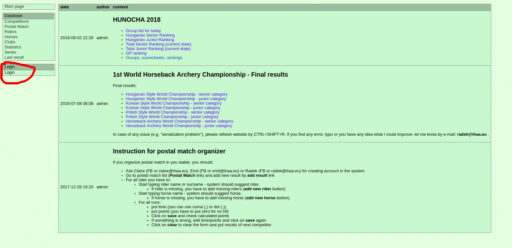

# Tutoriel pour l'utilisation du logiciel IHAA.eu

1. Pour organiser une competition, vous avez besoin d'avoir un compte dans le système. Demandez à un administrateur
    (Dan, Clair, Emil, Anders, Radek).

    Connectez-vous via l'onglet login.
    

2. Vérifier que tous les compétiteurs sont bien déjà enregistrés dans le système (dans l'onglet Riders à gauche).

    

    Vous pouvez sélectionner uniquement les cavaliers français grâce au menu déroulant 'all countries'.

    S'il manque des cavaliers, vous pouvez les ajouter grâce au bouton en haut à gauche 'add new rider to system'.

    

    Une fenêtre va s'ouvrir avec les informations à compléter.

    

3. Vérifier que tous les chevaux sont dans le système.

    

    Si non, ajouter les chevaux manquants grâce au bouton 'add new horse to system'.

    

4. Aller sur l'onglet 'Competitions'.

    

    Créer une nouvelle compétition en cliquant sur le bouton 'new'.

    

    Une fenêtre va s'ouvrir avec les informations à compléter.

    

5. Aller sur l'onglet 'Styles'.

    

    Vous arrivez sur une fenêtre où vous devez sélectionner votre compétition.

    

    Vous arrivez sur une page vide où vous allez pouvoir configurer les styles que vous souhaitez pour votre compétition.

    1. Pour une épreuve de type hongroise, cliquez sur 'Add new style', puis sur le bouton 'add this style' en face de 'Hungarian Style'.

    

    Cliquez sur 'Save' pour ajouter l'épreuve.

    2. Pour une épreuve de type coréenne:
        * 'Korean Style' correspond à l'épreuve de Grand Prix 2-3-5 sur 150m;
        * 'Korean 123' correspond à l'épreuve sur 90m single shoot - double shoot - multi;
        * 'Korean '233' correspond à l'épreuve sur 90m double shoot - triple shoot - multi.

    3. Pour une épreuve de type parcours polonais, il faut configurer les options de la piste:

    

      Le nombre de cibles à toucher pour que les points de temps soient accordés correspond à un tiers des cibles (arrondi à l'inférieur): 6 cibles à toucher pour 18 cibles au total, 5 cibles pour entre 15 et 17 cibles au total, ect...

6. Aller sur l'onglet 'Groups'.

    

    Sélectionner une épreuve grâce au menu déroulant 'SELECT' en haut à gauche. Cliquez sur 'add rider to group'.

    

    Une fenêtre s'ouvre pour ajouter les cavaliers un par un. Commencez à entrer le nom du cavalier, et l'autocomplétion devrait vous permettre de le retrouver.

    

    Cliquer sur 'Save' ou appuyer sur Entrée pour valider la saisie. Le couple que vous venez de saisir va apparaître sur la liste.

    

    En cas d'erreur, vous pouvez modifier la saisie en cliquant sur 'edit' à côté du nom du couple. Vous pouvez supprimer un couple en cliquant sur le bouton 'remove'.

    Cliquer sur 'add rider to group' pour ajouter le couple suivant, jusqu'à ce que tous vos groupes de compétiteurs soient entrés dans le système.

    Une fois que tous les compétiteurs sont saisis pour une épreuve, cliquer sur 'additional buttons'.

    

    Puis cliquer sur 'copy below group'.

    

    Sélectionner une autre épreuve dans le menu déroulant, puis cliquer sur 'Save'. Répétez l'opération pour toutes vos autres épreuves.

7. Pour imprimer les feuilles de scores pour la compétition, retourner sur l'onglet 'Styles'.

    

    La liste des groupes peut être imprimée sur le lien 'group list'.

    

    Pour les feuilles de scores, il y a plusieurs options:
     * 'group form' : toutes les lignes de runs dans l'ordre du passage par groupe
     * 'scoresheet form': une feuille de score par cavalier
     * 'target form' : une feuille par cible, parfait pour les commissaires de piste sur un parcours polonais.

   Pour imprimer, copier-coller le contenu de la page vers un éditeur de texte tel que Word, Google Docs ou Libre Office (il n'est pas recommandé d'imprimer directement à partir du site).

   Alternativement, les feuilles de score type pour les épreuves hongroises et coréenne sont jointes en annexe.

   Même si vous utilisez le logiciel pour rentrer les résultats de la compétition au fur et à mesure, une double prise de notes papier est obligatoire pour les compétitions officielles.

8. Pour rentrer les résultats dans le logiciel au fur et à mesure de la compétition, aller sur l'onglet 'Judging'.

    

    Si vous avez l'erreur 'No active competition', allez sur l'onglet 'Competitions' et sélectionner votre compétition grâce au bouton 'select'.

    

    Sélectionner votre épreuve puis votre groupe de départ grâce aux deux menus déroulants en haut à gauche. Vous arrivez sur une page comme ceci :

    

    Pour chaque compétiteur et chaque passage, vous pouvez cliquer sur le bouton 'EDIT' en fin de ligne pour rentrer le temps et les points cibles.
     * Le temps peut être saisi en utilisant un point (18.2) ou une virgule (18,2).
     * Les points cibles du la hongroise peuvent être saisis flèche par flèche (233) ou bien globalement (8).
     * S'il n'y a pas de flèche en cible, il faut saisir 0.
     * 'At least 3' pour la hongroise signifie que au moins 3 flèches ont été tirées (pas nécessairement en cible). Si moins de 3 flèches ont été tirées, les points temps ne sont pas comptabilisés.
    Cliquer sur 'Save' ou taper Entrée pour terminer la saisie. Elle peut être modifiée en cas d'erreur de nouveau à l'aide du bouton 'EDIT'.

9. Pour rentrer les résultats après la compétition, par exemple pour le parcours polonais, aller sur l'onglet 'Target result'.

    

    Sélectionner votre épreuve et votre cible grâce aux deux menus déroulants en haut à gauche. Sélectionner 'time' pour rentrer le temps du passage.

    Les entrées qui ont été modifiées s'affichent en jaune. Cliquer sur 'SAVE ALL' pour enregistrer la saisie.

    

    Répéter l'opération pour toutes les cibles et pour le temps.

10. Imprimer les résultats finaux, via l'onglet 'Ranking'.

    

    Vous pouvez visualiser les divers classements (ranking): par pourcentage, en junior/senior, les résultats bruts par épreuve.

    Vous avez également accès aux feuilles de scores de tous les compétiteurs, par épreuve (scoresheet).

11. Une fois que la compétition est terminée et que les résultats sont validées, clore la compétition.
    Aller sur l'onglet 'Competitions', et cliquer sur le bouton 'close' à côté de votre compétition.

    

    **Attention ! Une fois que la compétition est fermée, elle ne peut pas être ré-ouverte, et les résultats ne peuvent plus être modifiés. Ne fermer la compétition que lorsque les résultats sont définitifs.**
